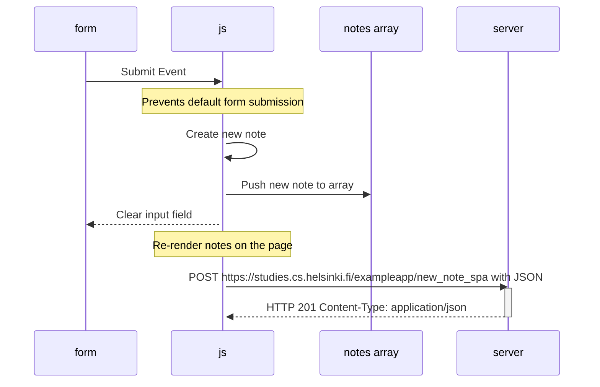

```mermaid

sequenceDiagram
    participant form
    participant js
    participant notes array
    participant server

    form->>js: Submit Event
    activate js
    Note over js: Prevents default form submission
    js->>js: Create new note
    js->>notes array: Push new note to array
    js-->>form: Clear input field
    Note over js: Re-render notes on the page
    
    js->>server: POST https://studies.cs.helsinki.fi/exampleapp/new_note_spa with JSON
    activate server
    server-->>js: HTTP 201 Content-Type: application/json
    deactivate server

```
